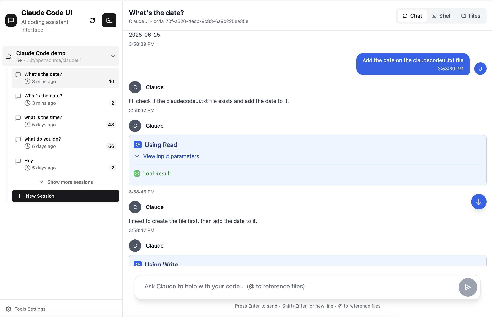

<div align="center">
  
  <h1>Claude Code UI</h1>
</div>

# Claude Code UI - 日本語版ガイド

[Claude Code](https://docs.anthropic.com/en/docs/claude-code) のためのデスクトップ・モバイル対応UIです。Anthropic公式のAI支援コーディングCLIを、使いやすいWebインターフェースで操作できます。

## 📱 スクリーンショット

<div align="center">
  
<table>
<tr>
<td align="center">
<h3>デスクトップ版</h3>

<br>
<em>プロジェクト概要とチャット画面</em>
</td>
<td align="center">
<h3>モバイル版</h3>

<br>
<em>タッチ操作対応のレスポンシブデザイン</em>
</td>
</tr>
</table>

</div>

## 🚀 はじめに

### 必要な環境

- [Node.js](https://nodejs.org/) v20 以上
- [Claude Code CLI](https://docs.anthropic.com/en/docs/claude-code) がインストール済み

### インストール方法

1. **リポジトリをクローンする**
```bash
git clone https://github.com/kazujp225/-ym-.git
cd -ym-
```

2. **依存関係をインストール**
```bash
npm install
```

3. **環境設定**
```bash
cp .env.example .env
# 必要に応じて.envファイルを編集
```

4. **アプリケーションを起動**
```bash
npm run dev
```

5. **ブラウザでアクセス**
   - 開発環境: `http://localhost:6667`
   - APIサーバー: `http://localhost:6666` (内部使用)

## 🛡️ セキュリティ設定

**重要**: すべてのClaude Codeツールは**デフォルトで無効**になっています。

### ツールを有効にする方法

1. **ツール設定を開く** - サイドバーの歯車アイコンをクリック
2. **必要なツールのみ有効にする** - 使用するツールだけを選択
3. **設定を適用** - 設定は自動的に保存されます

<div align="center">


*必要なツールのみを有効にできます*

</div>

## 🎯 使い方

### 基本機能

#### プロジェクト管理
- **プロジェクト一覧**: `~/.claude/projects/`から自動的にプロジェクトを読み込み
- **プロジェクト操作**: 名前変更、削除、整理が可能
- **クイックアクセス**: 最近使用したプロジェクトとセッションに素早くアクセス

#### チャット機能
- **2つの操作方法**: 専用チャットインターフェースまたはシェルボタンでClaude Code CLIに直接アクセス
- **リアルタイム通信**: WebSocketでClaudeからのレスポンスをストリーミング
- **セッション管理**: 以前の会話を再開、または新しいセッションを開始
- **履歴管理**: タイムスタンプとメタデータ付きの完全な会話履歴
- **多様な形式に対応**: テキスト、コードブロック、ファイル参照

#### ファイル操作
- **ファイルツリー**: プロジェクト構造を展開/折りたたみで表示
- **ライブ編集**: インターフェース上でファイルを直接読み取り、編集、保存
- **シンタックスハイライト**: 複数のプログラミング言語に対応
- **ファイル操作**: ファイルやディレクトリの作成、名前変更、削除

#### Git操作
- **変更の確認**: 変更されたファイルを表示
- **ステージング**: 変更をステージングエリアに追加
- **コミット**: 変更をコミット
- **ブランチ切り替え**: 異なるブランチに切り替え

#### セッション管理
- **自動保存**: すべての会話が自動的に保存
- **整理機能**: プロジェクトとタイムスタンプでセッションをグループ化
- **セッション操作**: 名前変更、削除、会話履歴のエクスポート

### 📱 モバイル対応

- **レスポンシブデザイン**: すべての画面サイズに最適化
- **タッチ操作**: スワイプジェスチャーとタッチナビゲーション
- **モバイルナビゲーション**: 親指操作しやすいボトムタブバー
- **ホーム画面追加**: PWAとしてホーム画面にショートカットを追加可能

## 🔧 よくある問題と解決方法

### "Claude プロジェクトが見つかりません"
**問題**: UIでプロジェクトが表示されない
**解決方法**:
- [Claude CLI](https://docs.anthropic.com/en/docs/claude-code)が正しくインストールされているか確認
- 少なくとも1つのプロジェクトディレクトリで`claude`コマンドを実行して初期化
- `~/.claude/projects/`ディレクトリが存在し、適切な権限があることを確認

### ファイル操作の問題
**問題**: ファイルが読み込めない、権限エラー、空のディレクトリ
**解決方法**:
- プロジェクトディレクトリの権限を確認（`ls -la`）
- プロジェクトパスが存在しアクセス可能であることを確認
- サーバーコンソールログで詳細なエラーメッセージを確認

## 🤝 貢献・開発

### 開発の始め方
1. **フォーク**: リポジトリをフォーク
2. **クローン**: `git clone <your-fork-url>`
3. **依存関係**: `npm install`
4. **ブランチ作成**: `git checkout -b feature/amazing-feature`

### 開発プロセス
1. **変更を加える**: 既存のコードスタイルに従う
2. **テスト**: すべての機能が正しく動作することを確認
3. **品質チェック**: `npm run lint && npm run format`
4. **コミット**: 説明的なメッセージでコミット
5. **プッシュ**: ブランチにプッシュ
6. **プルリクエスト**: 変更内容の説明と共に作成

## 📄 ライセンス

GNU General Public License v3.0 - 詳細は[LICENSE](LICENSE)ファイルを参照

## 🙏 謝辞

### 使用技術
- **[Claude Code](https://docs.anthropic.com/en/docs/claude-code)** - Anthropic公式CLI
- **[React](https://react.dev/)** - UIライブラリ
- **[Vite](https://vitejs.dev/)** - 高速ビルドツール
- **[Tailwind CSS](https://tailwindcss.com/)** - CSSフレームワーク
- **[CodeMirror](https://codemirror.net/)** - 高機能コードエディタ

---

<div align="center">
  <strong>Claude Codeコミュニティのために作られました</strong>
</div>